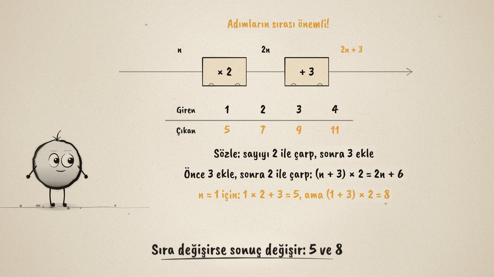
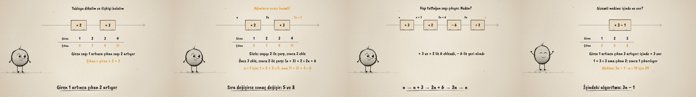

# Sayı Makinesi · Algorithms and Expressions

**▶ Tarayıcıda izleyin / Watch in the browser:** https://hakanatas.github.io/sayi-makinesi/ 
**⬇ MP4 + altyazılar / MP4 + subtitles:** [Releases](https://github.com/hakanatas/sayi-makinesi/releases) 
**✎ Kullanılan istem / The prompt behind it:** [PROMPT.md](PROMPT.md) 
**🎞 Bütün filmler / All films:** [Nokta'nın Filmleri](https://hakanatas.github.io/nokta-filmleri/?sinif=6)

> **TR —** 6. sınıf matematik "İşlemlerle Cebirsel Düşünme ve Değişimler" temasındaki MAT.6.2.3 öğrenme çıktısı için hazırlanmış, tamamen JavaScript ile çizilen 92 saniyelik mürekkep animasyonu. Bir sayı makinesinin algoritması: önce 2 ile çarp, sonra 3 ekle. 1, 2, 3, 4 atılınca 5, 7, 9, 11 çıkıyor; tabloda giren 1 artınca çıkan 2 artıyor. Giren sayıya n denince yol boyunca n, 2n, 2n + 3 yazılıyor; sözle de anlatılıyor. Adımların sırası değişince sonuç değişiyor: (n + 3) × 2 = 2n + 6. Sonra bir sihir numarası: 3 ekle, 2 ile çarp, 6 çıkar, 2'ye böl; hep tutulan sayı çıkıyor, çünkü n → n + 3 → 2n + 6 → 2n → n. Son olarak içi görünmeyen bir makine tablosundan çözülüyor: 3n − 1. Altyazılar Türkçe, İngilizce ya da ikisi birlikte seçilebilir.

A 92-second ink animation for **6th-grade maths**, the last film of the second 6th-grade theme. Nokta, the ink character from [The Learning Ink](https://github.com/hakanatas/the-learning-ink), is the guide again. Each number ball carries a list of its values after every box (`ball` in `src/draw/film.js`), so the number it shows always matches the step it has just passed.

## Learning outcome

MEB, Türkiye Yüzyılı Maarif Modeli, Ortaokul Matematik, 6th grade, "İşlemlerle Cebirsel Düşünme ve Değişimler" theme:

**MAT.6.2.3. Cebirsel ifadeler içeren durumlardaki algoritmaları yorumlayabilme**
- a) Cebirsel ifadeler içeren durumlardaki algoritmik yapıyı inceler.
- b) İncelediği durumlardaki algoritmik yapıyı tablo temsiline veya cebirsel ifadelere dönüştürür.
- c) Dönüştürdüğü algoritmik yapının içerdiği matematiksel ilişkileri sözel olarak ifade eder.

## Scenes

| # | Time | Scene | What happens | Outcome |
|---|---|---|---|---|
| 1 | 0–10 s | Sayı makinesi | 5 goes in, becomes 10, comes out as 13. | a |
| 2 | 10–30 s | Algoritma ve tablo | × 2 then + 3: 1, 2, 3, 4 → 5, 7, 9, 11; one more in, two more out. | a, b |
| 3 | 30–46 s | Cebirsel ifade | n → 2n → 2n + 3, in words too; swapping the steps gives 2n + 6 (5 and 8 for n = 1). | a, b, c |
| 4 | 46–66 s | Sihir numarası | + 3, × 2, − 6, ÷ 2 always returns the number: n + 3, 2n + 6, 2n, n. | a, b, c |
| 5 | 66–80 s | Gizemli makine | From 1→2, 2→5, 3→8: × 3 then − 1, so 3n − 1. | b, c |
| 6 | 80–92 s | Aklında kalsın | An algorithm is ordered steps; table, expression; order matters. | a–c |

## Running it

- **Preview:** double-click `index.html` (it works offline).
- **MP4:** run `npm install` once, then `npm run export -- --format=horizontal --captions=tr`.
- **Subtitles and narration:** `npm run srt` writes `out/captions_*.srt` and `narration_notes.txt`.
- **Editing:**
  - Caption text, timings and narration notes: `captions.js`
  - Everything on screen is drawn by `LI.world(t)` in `scenes/scene1.js` (the three machines, their tables, the labels along the pipe); the other scenes only set the camera.
  - The machine, the number balls, fractions and Nokta's poses: `src/draw/film.js`; layout for 16:9 and 9:16: `src/draw/kd.js`

It uses the same engine as The Learning Ink: `renderFrame(t)` as a pure function of time, seeded randomness, and frame-by-frame export.

## Lisans · License

**TR —** Bu film ve kodu [Creative Commons Atıf-GayriTicari 4.0 Uluslararası (CC BY-NC 4.0)](https://creativecommons.org/licenses/by-nc/4.0/deed.tr) lisansıyla paylaşılır. Ticari olmayan her amaçla (derste, okulda, eğitim materyalinde) kopyalayabilir, paylaşabilir ve değiştirebilirsiniz; ancak **kaynak göstermek zorunludur**: eser sahibinin adı ve bu deponun bağlantısı belirtilmeden kullanılamaz. Ticari kullanım (satış, ücretli ürün ya da yayın) için izin alınmalıdır.

**EN —** This film and its code are licensed under [Creative Commons Attribution-NonCommercial 4.0 International (CC BY-NC 4.0)](https://creativecommons.org/licenses/by-nc/4.0/). You may copy, share and adapt them for non-commercial purposes, but **attribution is required**: they may not be used without crediting the author and linking to this repository. Commercial use requires permission.

Atıf örneği / Required credit: *“Sayı Makinesi”, Hakan Ataş, Nokta'nın Filmleri — https://github.com/hakanatas/sayi-makinesi — CC BY-NC 4.0*
